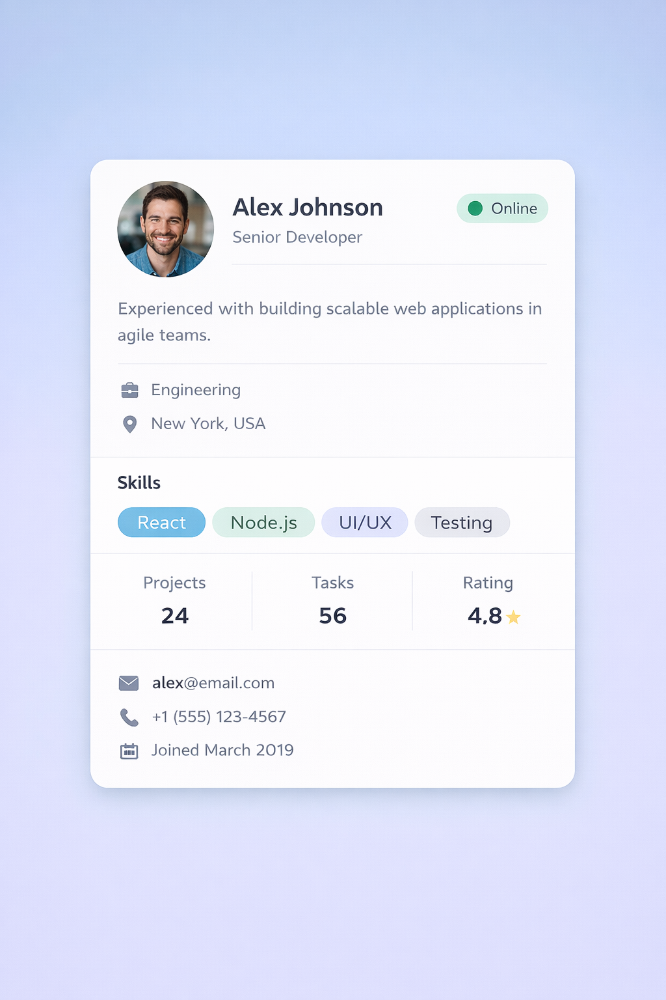

# React cding challenges

## Profile Card Layout

Build a clean profile card UI using React components and CSS.

Create a profile card that shows:
- Profile picture
- Name
- Job title
- Short bio
- Skills/tags section
- Contact info (email + location)
- Identify the component structure

**Specifications**

Profile Card
- Centered on screen
- Rounded corners
- Shadow
- Max width: 350px
- Clean spacing

Profile Image
- Circle image
- Centered
- Slight border

Skills Section
- Small rounded badges
- Light background color
- Inline layout

Sample Data
```text
Name: John Smith  
Role: Frontend Developer  
Bio: Passionate about building clean UI and learning React.  
Skills: React, CSS, JavaScript, Figma  
Email: john@email.com  
Location: New York
```

 


## Team Member Dashboard Card

Design a team member dashboard UI card like those used in company intranets or project tools.

Focus on:
- Clean layout
- Reusable components
- CSS styling & alignment
- Component hierarchy design

***What to Build***

A Team Member Card that displays:

Header Section
- Profile photo
- Name
- Role/Title
- Status badge (Online / Away / Busy)

Info Section
- Short bio (2–3 lines)
- Department
- Location

Skills Section
- Skill tags/badges
```text
React  Node  UI/UX  Testing
```

Stats
- Display 3 stats in a row:
```text
Projects | Tasks | Rating
   24    |  56   | 4.8⭐
```

Footer Section
- Email
- Phone
- Join date

**Stylinq Requirements**

Card
- Max width: 420px
- Rounded corners
- Soft shadow
- Centered on page

Status Badge
- Small pill shape
- Color coded:
    - Green → Online
    - Yellow → Away
    - Red → Busy

Skills Tags
- Rounded badges
- Light background
- Wrap to next line if needed

Stats Row
- Horizontal layout
- Equal spacing
- Divider lines between items

 